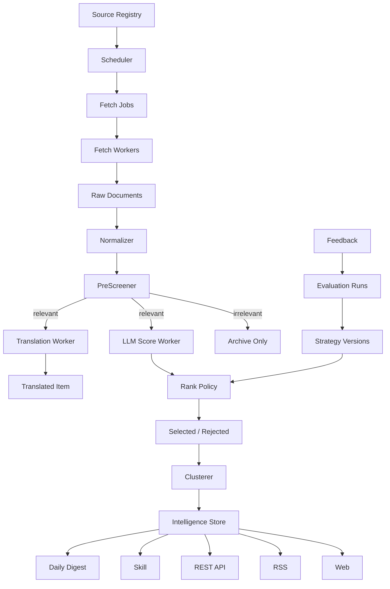

# AIHOT 系统完整深读：设计模式、运行模型与架构思路

## 资料与证据

本文件基于三篇文章正文、`.mhtml`、远程图片链接和下载后的 43 张图片综合分析。

本地证据文件：

- `data/aihot_images/article_evidence.md`：文章段落与图片上下文对应关系。
- `data/aihot_images/manifest.json`：图片下载清单。
- `data/aihot_images/site_contact_sheet.png`：AIHOT 网站文章图片总览。
- `data/aihot_images/skill_contact_sheet.png`：AIHOT Skill/API/RSS 文章图片总览。
- `docs/AIHOT_ARTICLE_DEEP_DIVE.md`：第一版文章拆解。

三篇文章合起来不是单点产品介绍，而是一套完整方法论：

```text
AIHOT 网站文章：解释情报产品和处理系统。
AIHOT Skill 文章：解释分发层和 Agent 接入。
能用脚本就别用 Agent：解释工程运行哲学。
```

## 总体判断

AIHOT 不是“AI 新闻站”，也不是“Agent 搜新闻工具”。它更接近：

```text
公开信源情报工厂
  + 策略实验平台
  + 多端分发系统
```

它的核心价值不在“抓得多”，而在把创作者或研究者脑子里的隐性筛选经验，沉淀成一套可运行、可回测、可调参、可分发的情报流水线。

最关键的架构原则是：

```text
LLM 负责语义中间量。
代码负责最终决策。
策略后台负责持续校准。
多出口消费同一份情报资产。
Agent 只作为消费端和开放分析端，不承担高频流水线。
```

## 产品模式

### 1. 注意力保护产品

AIHOT 解决的不是“有没有信息”，而是“信息太多时，哪些值得看”。

文章把工作流程拆成：

```text
获取信息 -> 分析信息 -> 基于信息做决策
```

AIHOT 主要解决第一步：获取信息，而且不是全量获取，而是“精选获取”。

因此它的产品价值是：

- 替用户盯住大量公开信源。
- 过滤无关信息。
- 降低重复报道。
- 给出为什么值得看的理由。
- 把高价值信息按时间线、日报、API、RSS、Skill 分发出去。

这决定了系统不能只做爬虫和摘要。爬虫只是入口，真正的产品核心是“选择机制”。

### 2. 前台产品结构

从 `site_01.jpg`、`site_02.png`、`site_06.png`、`skill_26.png` 可以看出，前台不是传统新闻卡片流，而是“时间线 + 推荐理由 + 分数 + 标签”的情报流。

单条信息大致包含：

- 时间。
- 来源账号或站点。
- 标题。
- 摘要。
- 原始链接。
- 分类标签。
- 精选标记。
- 分数。
- 推荐理由。
- 点赞、反馈、收藏等轻量动作。

推荐理由被放在卡片底部的显眼位置，说明 AIHOT 不只展示结果，也展示入选原因。

### 3. 公共版和内部版分层

文章和截图都显示，AIHOT 有内部能力和公开能力的区分。

公开用户看到的是：

- 精选。
- 全部 AI 动态。
- AI 日报。
- 低频爆文。
- 关于。
- 收藏。
- 反馈。
- Agent 接入。

内部或认证用户还能看到：

- 信源。
- 信源提报。
- 精选策略。
- 策略反馈。
- 策略评估。
- 模型评估。
- 流水线。
- 系统。

这说明 AIHOT 的真实产品不是一个前台站点，而是：

```text
用户端
  + 策略运营端
  + 信源管理端
  + 系统观测端
  + 接入开放端
```

我们的项目也不能只有用户 API。长期必须有运营后台，否则几百个信源和策略迭代无法维护。

## 运行模型

### 1. 信源运行模型

`site_05.png` 展示了信源管理页，能看到：

- 活跃信源：168。
- 总信源：229。
- 异常：0。
- 30 分钟内：162。
- X 信源：107。
- 已隐藏：61。

截图里的信源地图把来源按类型分组，例如：

- 官方网站。
- 大咖博客。
- 学校机构。
- 其他类别。

正文说明信源来源包括：

- RSS。
- HTML 抓取。
- 公开 API。
- 付费第三方接口。

并且信源被分成：

- `T1`：官方一手信息，如 OpenAI 官方博客、Anthropic 工程博客、CMU 博客。
- `T1.5`：官方社交账号，更新更快但更杂。
- `T2`：KOL、媒体、综合资讯站。

这说明信源不是配置文件里的 URL 列表，而是一个可运营对象。

正式模型应包含：

```text
Source
  id
  name
  channel
  source_type
  tier
  authority_weight
  noise_level
  fetch_adapter
  url
  enabled
  visibility
  owner
  created_at
```

还需要运行状态：

```text
SourceState
  source_id
  last_success_at
  last_error_at
  error_streak
  next_fetch_at
  avg_latency_ms
  items_per_run
  duplicate_ratio
  noise_ratio
  health_score
```

### 2. 全链路漏斗

`site_09.png` 展示了全链路漏斗：

```text
抓取入库：563
可评估条目：563
主评分完成：295，占抓取 52.4%
精选入选：78，占抓取 13.9%
飞书已推送：11，占抓取 2%
```

这个漏斗非常关键。它说明系统有多个状态层，不是“抓取成功 = 有效信息”。

合理的状态机应该是：

```text
fetched
  -> normalized
  -> prefiltered_relevant / prefiltered_irrelevant
  -> scored
  -> ranked
  -> selected / rejected
  -> clustered
  -> published
  -> pushed
```

每个阶段都应可统计数量、比例和失败原因。

### 3. 流水线全景

`site_13.png` 是整个系统最重要的架构图之一。它展示了一条信息从抓取到推送的大致流水线：

```text
0 抓取新内容
1 标准化整理
2 AI 快速分类
3 是否进入评分
4 AI 评分
5 计算最终分
6 精选判定
7 标题正文翻译
8 写入数据库
9 推送飞书
```

图里还明确标出不同阶段由谁负责：

- 抓取：扩展。
- 标准化整理：代码干活。
- AI 快速分类：AI 干活。
- 是否进入评分：决策点。
- AI 评分：AI。
- 计算最终分：代码策略。
- 精选判定：代码策略。
- 标题正文翻译：翻译链。
- 写入数据库：存数据。
- 推送飞书：推送。

更重要的是，图里说明评分链和翻译链是并行的：

```text
通过 -> 同时启动评分链和翻译两条任务
```

这意味着 AIHOT 的处理模型不是同步单函数，而是多阶段任务流水线。我们的架构也应该按任务阶段建模，而不是一个 `crawl_source()` 里做完所有事情。

### 4. 低成本预筛

`site_14.png` 展示了“AI 快速分类”阶段：

```text
用一个便宜快速的 AI 看一眼内容，分到 5 个篮子里：跟 AI 到底有没有关系。
```

截图里能看到：

- 使用 DeepSeek V3.2。
- 成本约 `¥0.001/条`。
- 只返回篮子标签，存进数据库。
- 前 3 个篮子放行进入评分，后 2 个直接拦下，不再评分。
- 正文优先于标题。
- 如果看不懂仍可放行，宁可多花几分钱也不要漏掉好新闻。

这体现了非常实用的成本策略：

```text
便宜模型做召回友好的粗筛。
强模型只处理通过粗筛的候选。
粗筛宁愿放宽，避免漏掉高价值信息。
```

这也说明“预筛”不是简单布尔值，而是一个分类结果，后续可以统计不同信源落入不同篮子的比例。

### 5. 评分链和翻译链

`site_15.png` 展示了通过预筛后的并行链路：

```text
评分链：AI 评分 -> 计算最终分 -> 精选判定
翻译链：标题正文翻译
```

它验证了一个关键架构思想：

```text
AI 评分不是最终选择。
AI 评分只是最终质量分的输入。
```

正文也明确说：

- 大模型只做五维评分。
- 不再让模型直接给最终分。
- 不再让模型判断是否精选。
- 最终分由代码公式计算。
- 是否精选由代码根据类别阈值决定。

这套模式可以概括为：

```text
LLM as feature extractor
Code as policy executor
```

### 6. 策略版本和成本观测

`site_12.png` 展示精选策略页，能看到：

- 策略版本：`v11`。
- 评分模型：DeepSeek V4 Pro。
- 翻译模型：DeepSeek V3.2。
- 日期：2026-04-27。
- 近 7 天精选率：10%，370/3819。
- 今日处理：2579，精选 291，过滤 2288。
- 平均 `qualityScore`：69.0。
- 近 7 日成本：¥58.90，18.9M tokens，评分 + 翻译。
- 右侧建议：已有评分结果，建议开始收敛异常样本。

这张图说明 AIHOT 有策略版本、模型版本、成本观测和异常样本收敛机制。

对我们来说，这意味着评分策略不能散落在代码常量里。应该有：

```text
StrategyVersion
  version
  scorer_model
  translator_model
  prompt_version
  rank_formula_version
  thresholds
  active_from
  active_to
  metrics
```

### 7. 策略评估和回测

`site_17.png` 展示策略对比报告，比较 `v7` 和 `v8`：

- 精选率。
- 精选数。
- AI 相关度分布。
- 质量分。
- Top 标签。
- 两版共识。
- 两版新增。
- 新增/旧版等差异。

文章也提到每次评分规则升级会重新评估过去 500 条新闻。

这说明 AIHOT 的评分不是“感觉调 prompt”，而是有评估集和回测。

这对我们非常重要。评分策略应具备：

- 固定样本集。
- 新旧策略对比。
- 指标统计。
- 差异样本审查。
- 策略回滚。

### 8. 人类反馈的边界

文章提到曾引入人类反馈标注机制，但最终发现规则越加越多，模型泛化能力越差。这里的真实经验不是“不要人类反馈”，而是：

```text
人类反馈应该用于校准策略和发现错误，
不应该无限堆进 prompt 变成长规则。
```

所以人类反馈的正确位置是：

- 收集误选、漏选样本。
- 标注原因。
- 进入评估集。
- 指导 RankPolicy 或阈值调整。
- 必要时改 prompt，但不让 prompt 承担所有业务策略。

### 9. 事件聚类

`site_20.png` 展示了同一事件下的关联讨论列表。正文说明 AIHOT 使用 embedding 把语义相近的条目聚成事件簇。

聚类逻辑包括：

- 同一事件只在精选页展示一条。
- 点开可以看到所有相关报道。
- 官方源优先当主条。
- 官网优先于官方推特。
- 官方推特优先于 KOL。

这说明 AIHOT 的前台展示单位并不一定是 raw item，而更可能是 event cluster。

推荐的数据结构：

```text
EventCluster
  id
  canonical_title
  category
  main_item_id
  first_seen_at
  last_seen_at
  score
  source_count
  member_count
  authority_source

ClusterMember
  cluster_id
  item_id
  source_id
  relation_score
  is_main
```

### 10. 日报生成

`site_21.png` 展示日报页面：

- 按日期归档。
- 有月度列表。
- 有最新一期。
- 有故事数量，例如 31 stories。
- 分为模型发布/更新等版块。

正文说明日报每天北京时间 8 点生成，使用过去 24 小时精选内容，按版块整理。

关键点是：日报不是重新让模型生成，而是消费已处理好的结构化情报。

```text
DailyDigest = 已精选条目 + 分类 + 排序 + 模板渲染
```

因此日报应属于发布层，而不是处理层。

## 分发模型

### 1. 三个接入面

`skill_31.png`、`skill_32.png`、`skill_42.png`、`skill_43.png` 展示了 AIHOT 的 Agent 接入页。

它有三个 Tab：

- Skill。
- RSS。
- REST API。

对应三类人群：

```text
Skill：Agent 用户。
RSS：阅读器用户。
REST API：开发者和内部系统。
```

这说明 AIHOT 的数据资产不是给一个页面用的，而是给多个消费端复用。

### 2. Skill 模式

`skill_32.png` 显示：

- 遵循 Agent Skills 开放标准。
- 跨 Claude Code、Codex、Cursor、Gemini CLI、GitHub Copilot、OpenCode、Cline、Windsurf 等。
- 不需要 API Key。
- 不需要配 MCP server。
- 一句话安装。

`skill_34.png`、`skill_35.png`、`skill_39.png` 展示了命令行 Agent 调用结果。可以看到 Skill 会读取文件、运行 shell 命令，然后输出 Markdown 简报。

Skill 支持的模式包括：

- 今天 AI 日报。
- 指定日期日报。
- 最近几天日报。
- 精选模式。
- 全量 AI 动态。
- 按时间窗口查。
- 按分类查。
- 按关键词查。

默认策略是使用精选信息，保护注意力。时间窗口最长支持 7 天，用于控制数据量和服务器压力。

这说明 Skill 不是“给 Agent 一个万能搜索能力”，而是给 Agent 一个受控查询接口。

推荐 Skill 工具接口：

```text
get_daily(date?)
get_dailies(window?)
get_items(mode=selected|all, category?, window?, keyword?)
get_cluster(cluster_id)
```

### 3. RSS 模式

`skill_42.png` 展示了三个 RSS Feed：

- `https://aihot.virxact.com/feed.xml`：AI HOT 精选，每日精选候选池，最新 50 条。
- `https://aihot.virxact.com/feed/all.xml`：全部 AI 动态，抓取的全部 AI 行业内容流，最新 50 条。
- `https://aihot.virxact.com/feed/daily.xml`：AI HOT 日报，每天 08:00 北京时间发布，最新 30 期。

这说明 RSS 也不是一个全量出口，而是按消费意图拆分。

### 4. REST API 模式

`skill_43.png` 展示 REST API 页：

- OpenAPI 3.1。
- 匿名只读。
- 无需 token。
- 必须带 User-Agent。
- 浏览器、RSS reader、主流 SDK 默认 UA 可用。
- 默认 curl UA 会被 nginx 黑名单拦截为 403。
- 页面建议优先读 `/openapi.yaml` 拿严格 schema。
- 响应只暴露最终内容字段。
- 评分、AI 标签、内部分类编号一律剥离。

端点包括：

```text
GET /api/public/items
GET /api/public/daily
GET /api/public/daily/{YYYY-MM-DD}
GET /api/public/dailies
```

这非常关键：公开 API 和内部策略字段有隔离。外部只拿消费所需字段，不拿内部评分细节和策略标签。

我们的 API 也应分层：

```text
public API：干净、稳定、只读、隐藏策略字段。
internal API：策略评估、信源状态、评分细节、回测样本。
```

## 架构模式抽象

### 1. Source Registry 模式

信源是系统资产，不是配置项。

它有：

- 类型。
- 等级。
- 权重。
- 抓取方式。
- 运行状态。
- 噪声比例。
- 活跃状态。
- 是否隐藏或公开。

### 2. Staged Pipeline 模式

所有处理被拆成阶段：

```text
抓取 -> 标准化 -> 预筛 -> 评分 -> 公式计算 -> 精选 -> 翻译 -> 聚类 -> 入库 -> 发布
```

每个阶段都能独立观测、重试、回放和统计。

### 3. Cheap Gate 模式

便宜模型或轻量规则先做粗筛，保护昂贵模型成本。

### 4. LLM Feature Extraction 模式

LLM 不直接做最终业务决策，只产出结构化中间量。

### 5. Policy as Code 模式

最终分、阈值、类别策略、来源权重、重复惩罚都由代码公式控制。

### 6. Strategy Versioning 模式

评分策略有版本。每次升级都可以和旧版对比、回测、回滚。

### 7. Human Feedback as Evaluation 模式

人类反馈不直接堆到 prompt 里，而是进入异常样本池和评估集。

### 8. Event Cluster 模式

前台展示事件，不展示重复条目。一个事件可以有多个来源和多个相关讨论。

### 9. Prepared Data Publishing 模式

日报、RSS、API、Skill 都消费已处理好的情报资产，不在发布时重新推理。

### 10. Agent as Consumer 模式

Agent 不跑高频流水线。Agent 读取平台数据，做开放分析、汇总和工作流嵌入。

## 推断的数据架构

### 核心写入表

```text
sources
source_states
fetch_jobs
fetch_runs
raw_documents
normalized_items
prefilter_results
model_scores
translations
ranked_items
event_clusters
cluster_members
publish_events
```

### 策略治理表

```text
strategy_versions
prompt_versions
rank_policy_versions
threshold_sets
feedback_events
evaluation_samples
evaluation_runs
strategy_comparisons
cost_metrics
```

### 发布层表

```text
daily_digests
daily_digest_items
rss_exports
api_access_logs
skill_access_logs
```

### 最小关键字段

`normalized_items`：

```text
id
source_id
channel
title_original
title_cn
url
canonical_url
summary_original
summary_cn
published_at
fetched_at
raw_document_id
content_hash
language
```

`model_scores`：

```text
item_id
strategy_version
model
relevance
impact
novelty
actionability
credibility
category
reason
raw_json
```

`ranked_items`：

```text
item_id
strategy_version
source_weight
category_weight
freshness_weight
duplicate_penalty
final_score
selected
selection_reason
threshold_used
```

`event_clusters`：

```text
id
channel
canonical_title
main_item_id
category
first_seen_at
last_seen_at
member_count
source_count
cluster_score
```

## 推断的服务架构



架构分面：

```text
采集运行面：Source Registry、Scheduler、Fetch Worker。
智能处理面：PreScreener、LLM Score、Translation、Clusterer。
策略治理面：Rank Policy、Strategy Version、Feedback、Evaluation。
发布分发面：Web、RSS、REST API、Daily Digest。
Agent 接入面：Skill、受控查询、Markdown 输出。
```

## 对我们项目的直接启发

### 1. 不应继续按脚本抓取器推进

当前 MVP 的 `channels/*.yaml -> crawl_enabled_sources -> ingest_items -> SQLite` 可以验证概念，但不适合几百信源。

正式架构必须先升级为：

```text
Source Registry + Scheduler + Pipeline + Strategy + Cluster + Publisher
```

### 2. RSS/API/Skill 不应该最先做深

RSS/API/Skill 是发布层。它们应该消费稳定的情报资产。如果底层还没有：

- 信源状态。
- 原始内容。
- 预筛结果。
- 评分中间量。
- 策略版本。
- 聚类结果。

那么过早开放分发层会把不稳定 schema 固化出去。

正确顺序：

```text
信源运行平台
  -> 处理流水线
  -> 策略评分
  -> 事件聚类
  -> 日报/RSS/API/Skill
```

### 3. Amazon 频道也要采用同样架构

Amazon 卖家情报不是“亚马逊新闻”。它也需要：

- 官方政策源优先。
- Marketplace 维度。
- 账号健康风险。
- FBA/费用影响。
- 广告/Listing/合规分类。
- 风险等级。
- 行动建议。
- 事件聚类。

Amazon 的 `RankPolicy` 不应照搬 AI 频道，而应有卖家运营维度：

```text
seller_impact
compliance_urgency
fee_impact
marketplace_scope
actionability
deadline_pressure
source_authority
```

### 4. Agent 的边界要严格

Agent 应该做：

- 查询情报。
- 生成面向用户的中文简报。
- 对单个事件做深度影响分析。
- 帮我们复盘策略误判。
- 建议新增信源。

Agent 不应该做：

- 定时抓取。
- 全量去重。
- 最终评分。
- 阈值判断。
- API/RSS 输出。
- 高频日报生成。

## 最终架构原则

基于三篇文章和图片，AIHOT 的底层原则可以压缩成 10 条：

1. 信源比信息重要。
2. 先保护注意力，再追求覆盖率。
3. 抓取是基础，精选才是产品。
4. 便宜模型做粗筛，强模型做语义评分。
5. LLM 只输出中间量，不做最终控制。
6. 代码公式控制最终分、阈值和是否精选。
7. 策略必须版本化、可回测、可比较、可回滚。
8. 同一事件必须聚类，否则信息流会被重复污染。
9. Web、RSS、API、Skill 都应该消费同一份处理后的情报资产。
10. Agent 应该创造工具和消费情报，不应该承担确定性高频流程。

这也是我们项目下一步应该采用的正式架构原则。
