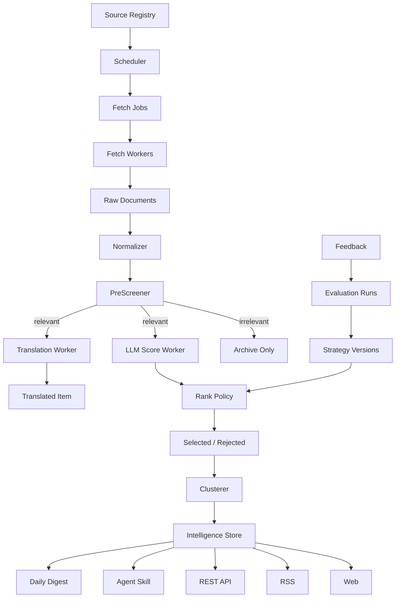

# 情报引擎生产架构

## 架构目标

本项目按生产级公开信源情报平台设计，目标不是完成一个抓取 MVP，而是支撑：

- 几百个公开信源。
- 多频道情报处理。
- 多阶段任务流水线。
- LLM 结构化中间量。
- 确定性策略打分。
- 事件聚类。
- 策略版本、回测和反馈。
- Web / RSS / API / Skill / 日报分发。

## 总体形态



架构分为五个面：

```text
采集运行面：Source Registry、Scheduler、Fetch Worker、Raw Store。
智能处理面：PreScreener、LLM Score、Translation、Clusterer。
策略治理面：Rank Policy、Strategy Version、Feedback、Evaluation。
发布分发面：Web、RSS、REST API、Daily Digest。
Agent 接入面：Skill、受控查询、Markdown 输出。
```

## 技术栈

### 后端核心

- Python 3.12+。
- FastAPI：公开 API、内部 API、OpenAPI schema。
- Pydantic v2：配置、API schema、LLM 输出 schema。
- SQLAlchemy 2：数据库访问。
- Alembic：schema migration。

### 数据库

- PostgreSQL 16+ 作为生产主库。
- pgvector 用于 embedding 和事件聚类。
- JSONB 用于保留模型原始结构化输出、抓取元数据和策略参数。
- SQLite 只允许作为本地单元测试临时数据库，不作为目标架构。

### 抓取和解析

- httpx：HTTP 抓取。
- feedparser：RSS/Atom。
- trafilatura：文章正文抽取。
- Playwright / Crawl4AI adapter：只用于少数高价值公开页面。
- 每类抓取器都通过 FetchAdapter 接口接入。

### 调度和队列

第一阶段使用 PostgreSQL job table：

```text
fetch_jobs
  + status
  + next_run_at
  + locked_at
  + locked_by
  + attempt_count
```

Worker 使用 `FOR UPDATE SKIP LOCKED` 并发领取任务。

后续当并发和运维复杂度上升时，可以迁移到 Celery、Dramatiq、Arq、Prefect 或独立队列，但业务接口保持不变。

### LLM 层

不直接引入 LangChain / LlamaIndex 作为核心链路。

采用自有 provider adapter：

```text
LLMProvider
  -> score_item()
  -> prefilter_item()
  -> translate_item()
  -> summarize_event()
```

所有 LLM 输出必须通过 Pydantic schema 校验后入库。

### 观测

- JSON structured logs。
- 每个 fetch run、model call、rank run、cluster run 记录成本和耗时。
- OpenTelemetry 预留。
- 后续接 Prometheus、Grafana、Sentry。

## 核心模块

### SourceRegistry

负责信源生命周期：

- 注册。
- 启停。
- 分层。
- 权重。
- 抓取适配器。
- 频率。
- 运行状态。
- 噪声率。
- 健康分。

### Scheduler

负责生成任务：

- 按 `next_fetch_at` 扫描到期信源。
- 根据优先级和失败退避生成 job。
- 控制同源并发。
- 控制每轮预算。

### FetchWorker

负责执行抓取任务：

- 调用 adapter。
- 保存响应状态。
- 保存原始内容。
- 更新 source state。
- 不做复杂业务判断。

### Normalizer

负责把不同信源的原始内容转成统一候选条目：

- URL 规范化。
- 标题清洗。
- 时间解析。
- 语言识别。
- 来源绑定。
- content hash。

### PreScreener

负责低成本预筛：

- 判断是否属于频道相关内容。
- 结果宁可召回高一点，也不能过早漏掉。
- 未通过也入库，用于统计信源噪声。

### LLMEnricher

负责结构化语义中间量：

- 中文摘要。
- 分类。
- 五维评分。
- 入选理由候选。
- Amazon 卖家影响字段。
- 原始 JSON 保留。

### RankPolicy

负责最终策略：

- 来源权重。
- 类别权重。
- freshness。
- duplicate penalty。
- Amazon 运营影响。
- 最终分。
- 精选阈值。

LLM 不允许直接决定最终精选。

### Clusterer

负责同事件聚合：

- 精确去重。
- 标题/正文近似去重。
- embedding 聚类。
- 主条选择。
- 相关来源折叠。

### Publisher

负责把处理后的情报资产分发：

- Web。
- RSS。
- REST API。
- Agent Skill。
- Daily Digest。

Publisher 不负责重新抓取、重新评分或重新聚类。

## 数据模型

### `sources`

```text
id
channel
source_type
tier
name
url
language
region
marketplace
authority_weight
noise_level
fetch_adapter
parser_type
default_categories
fetch_interval_minutes
enabled
visibility
notes
created_at
updated_at
```

### `source_states`

```text
source_id
last_success_at
last_error_at
error_streak
next_fetch_at
backoff_until
avg_latency_ms
items_per_run
duplicate_ratio
noise_ratio
health_score
updated_at
```

### `fetch_jobs`

```text
id
source_id
status
priority
run_after
locked_at
locked_by
attempt_count
last_error
created_at
updated_at
```

### `fetch_runs`

```text
id
job_id
source_id
status
started_at
finished_at
http_status
content_type
bytes_received
item_count
error_message
metadata_json
```

### `raw_documents`

```text
id
fetch_run_id
source_id
url
canonical_url
content_type
body_text
body_html
response_headers_json
content_hash
fetched_at
```

### `normalized_items`

```text
id
channel
source_id
raw_document_id
title_original
title_cn
url
canonical_url
summary_original
summary_cn
published_at
fetched_at
language
content_hash
created_at
updated_at
```

### `prefilter_results`

```text
id
item_id
strategy_version
model
bucket
is_relevant
reason
raw_json
created_at
```

### `model_scores`

```text
id
item_id
strategy_version
model
category
relevance_score
impact_score
novelty_score
actionability_score
credibility_score
reason
raw_json
created_at
```

### `ranked_items`

```text
item_id
strategy_version
source_weight
category_weight
freshness_weight
duplicate_penalty
channel_impact_weight
final_score
selected
threshold_used
selection_reason
created_at
```

### `event_clusters`

```text
id
channel
canonical_title
main_item_id
category
first_seen_at
last_seen_at
member_count
source_count
cluster_score
embedding
created_at
updated_at
```

### `cluster_members`

```text
cluster_id
item_id
source_id
relation_score
is_main
created_at
```

### `strategy_versions`

```text
id
channel
name
status
prefilter_prompt_version
score_prompt_version
rank_formula_version
thresholds_json
model_config_json
created_at
activated_at
retired_at
```

### `feedback_events`

```text
id
item_id
cluster_id
channel
feedback_type
reason
actor
created_at
```

### `daily_digests`

```text
id
channel
digest_date
generated_at
strategy_version
title
sections_json
published
created_at
```

## API 边界

### Public API

公开 API 只暴露消费字段：

- 标题。
- 摘要。
- 分类。
- 来源。
- 原文链接。
- 时间。
- 事件簇。
- 建议动作。
- 入选理由。

公开 API 不暴露：

- 内部策略版本。
- 模型原始 JSON。
- 内部分类编号。
- 精确评分公式。
- 信源私有备注。
- 成本和回测数据。

### Internal API

内部 API 用于：

- 信源管理。
- 流水线状态。
- 策略评估。
- 人类反馈。
- 成本看板。
- 模型评估。

内部 API 后续必须加认证、审计和角色权限。

## 安全边界

系统只处理公开信源和明确授权 API。

不得：

- 保存用户密码、OTP、Cookie、私有 token。
- 自动登录私有账号后台。
- 抓取需要登录的 Seller Central 页面。
- 自动点击授权页面。
- 绕过验证码、付费墙或访问控制。

未来如接入 Amazon SP-API，必须单独设计 OAuth、密钥管理、审计和租户隔离。

## 当前代码状态

当前代码仍是过渡实现：

```text
src/intel_engine/channel_config.py  频道 YAML 加载
src/intel_engine/scoring.py         MVP 加权评分
src/intel_engine/crawler.py         RSS/网页公开内容解析
src/intel_engine/normalizer.py      URL 规范化和 hash
src/intel_engine/storage.py         SQLite repository
src/intel_engine/ingest.py          简单入库
src/intel_engine/jobs.py            简单抓取 job
src/intel_engine/routes.py          公开 API
```

下一阶段要把这些模块迁移到生产架构，而不是继续堆 MVP 功能。
